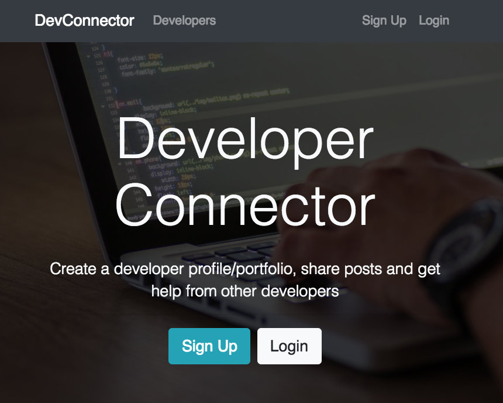
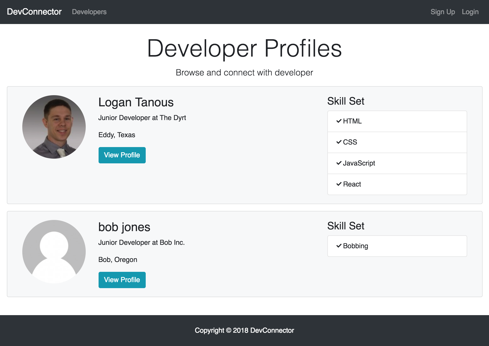
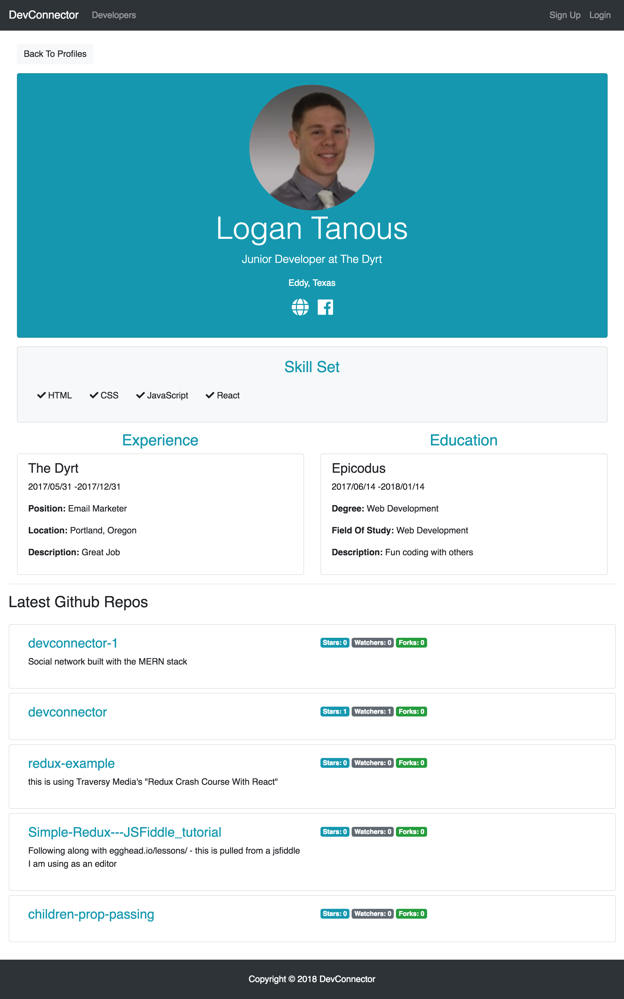
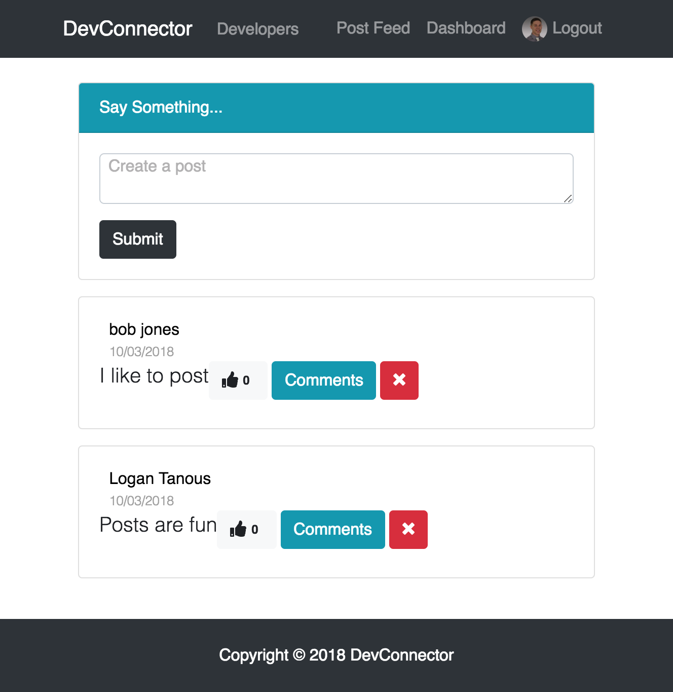
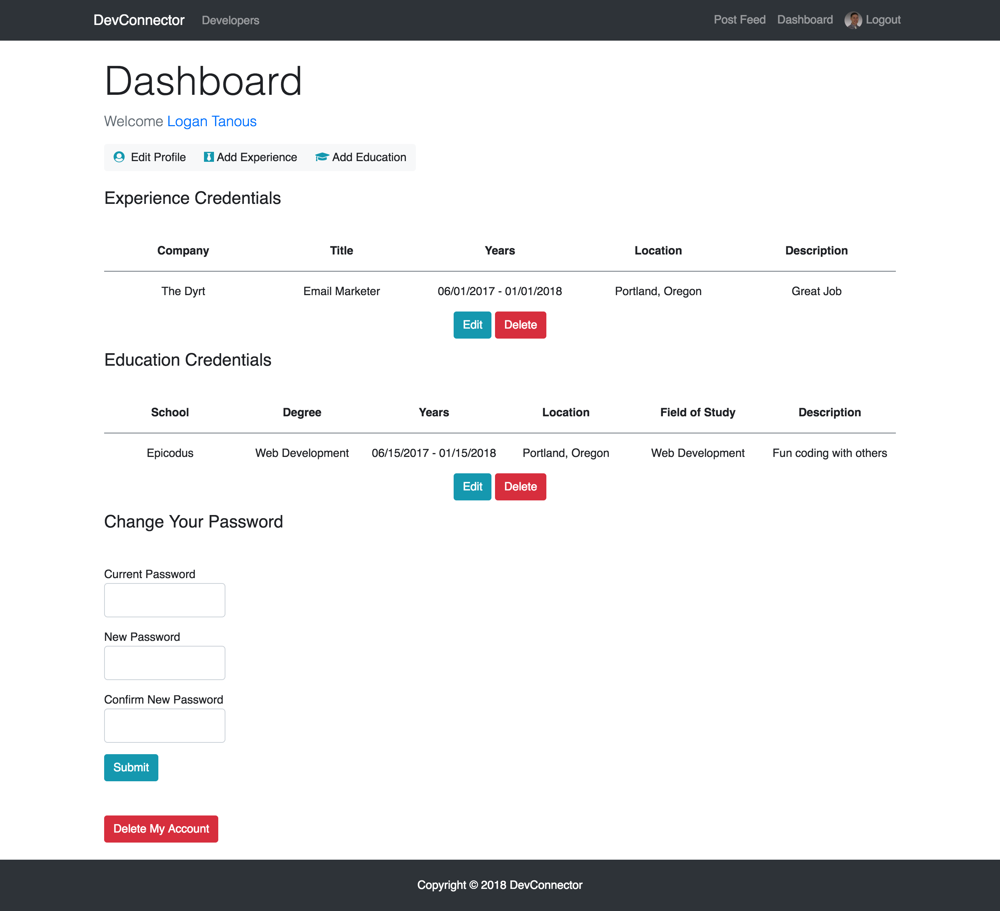
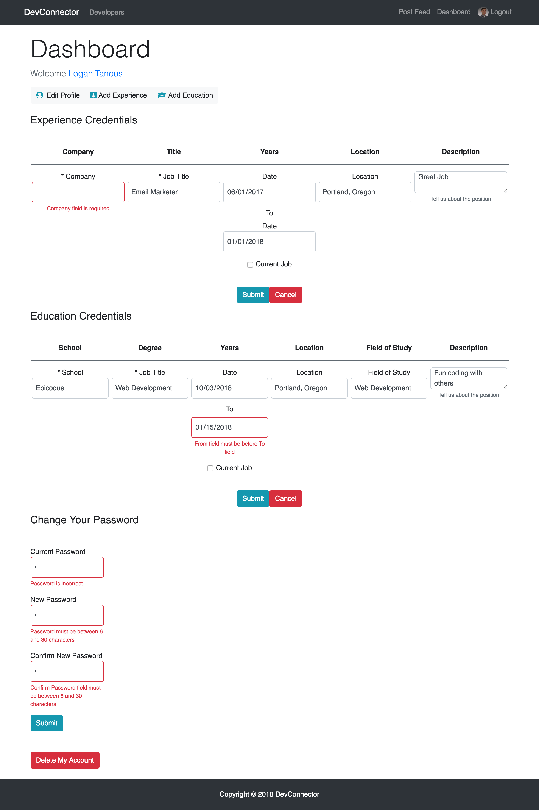

<h1>DevConnector</h1>

  

This is a simple linkedin clone using the MERN stack (MongoDB, Express, React, Redux, Node.js).

View live example here:  
<a href="https://thawing-island-18705.herokuapp.com/">https://thawing-island-18705.herokuapp.com/</a>

<h3>Local Installation</h3>
<ul>
  <li>git clone https://github.com/logmannn/devconnector</li>
  <li>cd devconnector</li>
  <li>npm install</li>
  <li>cd client</li>
  <li>npm install</li>
  <li>cd ..</li>
  <li>npm run dev</li>
  <li>Go to <a href="http://localhost:3000/">http://localhost:3000/</a></li>
</ul>

<h3>Features</h3>
<ul>
  <li>Login, Logout, Register with token expiration</li>
  <li>Create/delete your posts and comments</li>
  <li>Admin mode which allows the ability to delete posts and comments from the front-end</li>
  <li>Create your own Developer profile and view other's</li>
  <li>View your dashboard where you can add/edit/delete your profile, experiences, places of education and update your password
    <ul>
      <li>When editing experiences and educations there is an edit mode which resets your values to default on cancellation</li>
    </ul>
  </li>
  <li>Add your own avatar image with Gravatar</li>
  <li>Validations on all inputs. Examples:
    <ul>
      <li>Length of text</li>
      <li>Required entry</li>
      <li>Dates can't be in the future</li>
      <li>'From' date can't be after 'To' date</li>
      <li>Passwords must match</li>
      <li>Username already exists</li>
    </ul>
  </li>
  <li>Posts/comments are stored separately incase of user deletion</li>
</ul>

<h3>Images</h3>

